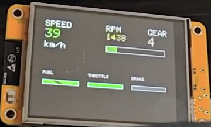

### ESP32 Head‑Up Display

This project implements a simple head‑up display using an ESP32 that receives vehicle data from BeamNG over UDP and renders it. 

### Requirements
- Arduino IDE (or PlatformIO) with ESP32 board support installed
- An ESP32 board
- A display compatible with the sketch

### Setup (ESP32)
1. Open `udp_packets/udp_packets.ino` in Arduino IDE.
2. Update Wi‑Fi credentials and network settings in the sketch if required (SSID, password, UDP port).
3. Select the correct board/port for your ESP32.
4. Upload the sketch.

### UDP sender (BeamNG)
1. Ensure the ESP32 and your computer are on the same network.
2. Add the file in the correct BeamNG folder 
3. Update the ESP32_IP variable. (Will be displayed on the ESP32's display after the successfull WiFi connection)

You should see the ESP32 receive packets and update the display accordingly.
